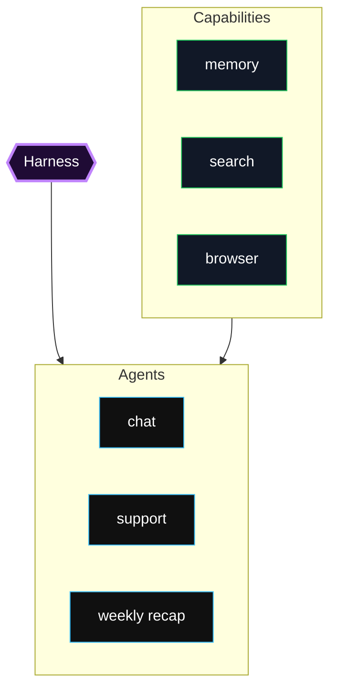
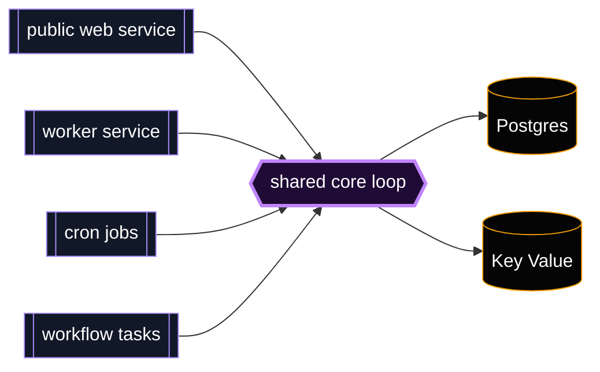
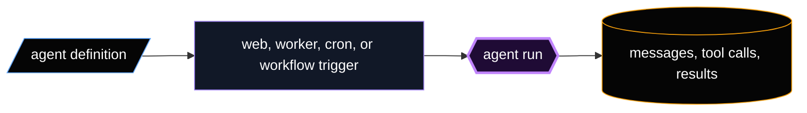
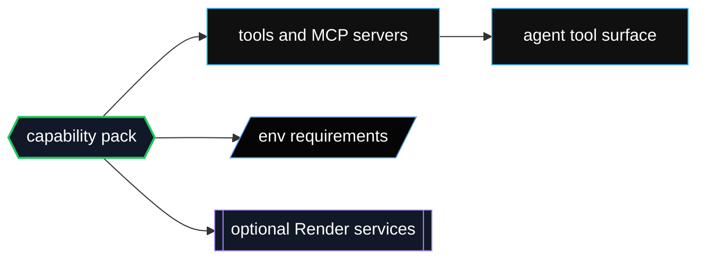

import ArchitectureGraph from "../../components/ArchitectureGraph.tsx";

## Structural model

The system is easier to read if you separate it into three parts:

- **Harness:** The platform layer. `@render-harness/core` owns the loop, model clients, prompt assembly, MCP execution, state writes, checkpointing, cancellation, and built-in tools. Runtime packages wrap that core and decide when to call it.
- **Agents:** The behavior layer. An agent is an `AgentDefinition` created with `defineAgent()` or loaded from `render-harness.yaml` through `@render-harness/registry`. It declares the model, system prompt, permissions, MCP servers, skills, and tool surface for one unit of work.
- **Capabilities:** The extension layer. A capability pack contributes reusable tools, optional setup, environment schema, and model-facing instructions. Packs attach to agents through `capabilities[]`; they do not own the runtime loop or deployment lifecycle.

The boundary is intentionally small. The harness can add new runtimes without changing agent definitions, agents can move between runtime shapes without changing their prompts and tools, and capabilities can be shared across templates without becoming global defaults.

## Infrastructure views

The abstract structure above maps to infrastructure at three different levels.

### Harness infrastructure

### Agent infrastructure

### Capability infrastructure

## How to read the graph

Use the graph below as a runtime flow explorer. Pick the question you are trying to answer, then click a node to see the package or service boundary it represents.

Workflows are a peer execution target, not a required hop after Cron.

- Manual/API workflow trigger: `web -> workflows`
- Model-delegated workflow trigger: `web -> worker -> trigger_workflow -> workflows`
- Scheduled workflow trigger: `cron -> workflows`

<ArchitectureGraph client:load />
