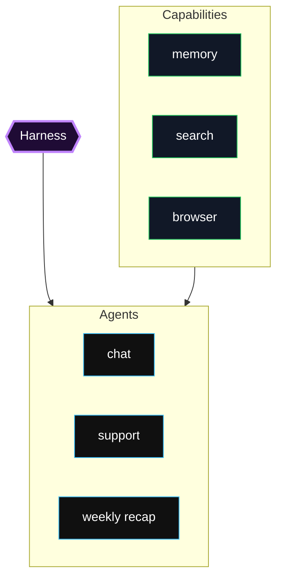
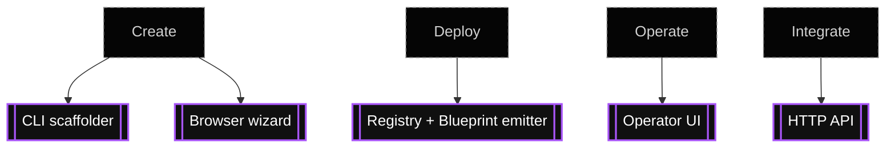

Render Harness is a TypeScript framework for building agents that run on Render primitives: Web Services, Workers, Cron Jobs, Workflows, Postgres, and Key Value.

The harness model is designed and optimized for Render service shapes. It maps agent work to the Render service that fits it: request entrypoints run through web services, queue-backed work runs on workers, scheduled work runs on Cron Jobs, durable long-running work runs on Workflows, and shared state lives in Render Postgres and Key Value.

Render Harness gives agent projects a shared execution loop, durable state, runtime-specific entrypoints, tool wiring, scaffolding, and an operator UI without asking authors to reassemble those Render services by hand.

Render Harness is extensible by design. The included agents, templates, examples, and capability packs are starting points: useful as shipped when they match your use case, and meant to be copied, edited, combined, or replaced when they do not. Your product logic lives in agents and capabilities; the harness supplies the production substrate around them.

## What you can build

Render Harness supports several agent shapes:

- Chat assistants that respond over HTTP and continue conversations across turns.
- Support bots that enqueue work, call tools, and stream progress back to an operator UI.
- Scheduled research agents that run on Cron and write durable reports.
- Personal assistant bundles with chat, memory, scheduled checks, and Workflow-backed deep work.
- Human-in-the-loop agents that pause for input or approval before writing state or triggering external actions.
- Tool-using agents that connect to MCP servers, built-in tools, and capability packs.

The same core loop runs all of these shapes. The runtime changes how work starts, how long it can run, and how users observe it.

These shapes are examples, not limits. You can define new agents, publish new capability packs, add MCP servers, build custom HTTP surfaces, or package multi-agent bundles that share the same underlying harness.

## What the harness gives you

The harness handles the platform work around your agent:

- Durable run state in Postgres.
- Tool calls and full tool result storage.
- Conversation state and streaming updates.
- Model adapters for Anthropic and OpenAI-compatible providers.
- Built-in tools for time, URL fetches, search, extraction, image generation, user input, and Workflow triggers.
- MCP server wiring for external tools.
- Capability packs for memory, browser automation, search, scraping, and filesystem access.
- A `render-harness.yaml` manifest that describes agents, runtimes, capabilities, environment variables, and deployment shape.
- A registry and Blueprint emitter that turn the manifest into Render services.
- CLI and browser scaffolding flows for starting from a gallery template.
- An optional operator UI at `/ui` for chat, run inspection, agents, usage, and guides.

## The mental model

Think of the project as three structural parts:

- **Harness:** The shared runtime substrate. It owns the model loop, runtime adapters, state, streaming, cancellation, MCP wiring, built-in tools, and Render deployment shapes.
- **Agents:** The behavior layer that runs on the harness. An agent starts as a `defineAgent()` TypeScript definition, or as a `render-harness.yaml` manifest that resolves to one. It declares the prompt, model, permissions, MCP servers, skills, tools, and runtime triggers.
- **Capabilities:** Reusable extension packs that add tools, environment variables, setup requirements, and prompt guidance. Capabilities live outside the core loop so agents can opt into memory, browser automation, search, scraping, filesystem access, and similar integrations.

Those parts compose in one direction:

1. Define an agent or bundle in TypeScript and `render-harness.yaml`.
2. Load the manifest through the registry to produce runnable agent definitions.
3. Merge in built-in tools, configured MCP servers, and selected capabilities.
4. Start work through the runtime that matches the job.
5. Store state in Postgres and control signals in Key Value.

`@render-harness/core` owns the model loop. Runtime packages decide when to call the loop. The registry turns config into code and infrastructure. Capability packs extend an agent without becoming global defaults.

## Runtime choices

Choose the runtime based on how the work starts:

| Work type | Runtime path |
| --- | --- |
| Short request/response demo | `runtime-web` |
| Interactive chat or API work | `web -> runtime-worker` |
| Scheduled short work | `runtime-cron` |
| Scheduled durable work | `runtime-cron -> runtime-workflows` |
| Manual durable work | `web -> runtime-workflows` |
| Model-delegated deep work | `web -> runtime-worker -> trigger_workflow -> runtime-workflows` |

Cron is only the scheduler path. Workflows can also start directly from the web service or from a model tool call.

## Start from a template

The gallery includes these starter shapes:

- `chat`: Minimal HTTP chat agent.
- `support-bot`: Web and worker shape for queued support flows.
- `research-cron`: Scheduled research agent with search.
- `chief-of-staff`: Multi-agent bundle with chat, memory, meeting prep, weekly recap, interview prep, and feedback capture.

The Chief of Staff bundle is the most complete example because it uses web, worker, cron, workflows, memory, and multiple agent entrypoints in one deployment. Treat it as a reference architecture as much as a starter: keep what is useful, replace the agent prompts and capabilities that are specific to your own workflow, and add new agents as the product grows.

## How you use it

Render Harness is not only a runtime library. It has different surfaces for different jobs:

- Use the CLI scaffolder to create a local project.
- Use the browser wizard to pick a template and create a managed repo/deploy flow.
- Use the template catalog to define what starters are available.
- Use the deployed operator UI to chat, inspect runs, view agents, edit config, and read guides.
- Use the HTTP API to integrate custom frontends, bots, webhooks, and internal tools.
- Use the registry APIs when you are extending the framework itself.

See [Ways to use Render Harness](/ways-to-use/) for the full map.

## Platform surfaces

Render Harness has four user-facing surfaces:

| Surface | What it does |
| --- | --- |
| CLI scaffolder | Creates a local project from a blank prompt or starter template. |
| Browser wizard | Creates a guided repo/deploy flow from the same template catalog. |
| Deployed operator UI | Operates a running harness at `/ui`. |
| HTTP API | Integrates agents with external apps, bots, webhooks, and internal tools. |

It also has framework surfaces for contributors:

- Registry APIs for manifest loading, template loading, capability packs, and Blueprint emission.
- Runtime packages for web, worker, cron, and Workflows.
- Core APIs for model loops, tools, MCP, state, and cancellation.

## What to read first

If you want to understand the system, start here:

- [Architecture](/architecture/): Understand the structural model, infrastructure boundaries, and runtime paths.
- [Ways to use](/ways-to-use/): Compare the CLI, wizard, template catalog, deployed UI, HTTP API, and registry APIs.
- [Core loop](/core-loop/): Understand the shared execution engine.
- [Runtime paths](/runtime-paths/): Compare web, worker, cron, and Workflow execution.
- [Platform constraints](/platform-constraints/): Understand the Render limits that shape runtime choices.
- [Package map](/package-map/): Find which package owns each part of the system.
- [Registry and scaffolding](/registry-and-scaffolding/): Understand manifests, templates, and generated projects.
- [`render-harness.yaml` spec](/yaml-spec/): Learn the manifest format.
- [Deployment model](/deployment/): See how manifests map to Render services.

If you want to run or change code, start here:

- [Local development](/local-development/): Install dependencies, start Postgres and Key Value, and run examples.
- [Examples and Blueprints](/examples-and-blueprints/): Map examples to runtime shapes.
- [Web API](/web-api/): Integrate custom frontends, bots, webhooks, and internal tools.
- [Operator UI](/operator-ui/): Operate a deployed harness.
- [Capabilities](/capabilities/): Add tools and integration packs.
- [Template catalog](/template-catalog/): Add scaffoldable starters to the CLI and wizard.
- [Registry publishing](/registry-publishing/): Publish a finished deployable repo with a generated Blueprint and pinned SHA.
- [Authoring capability packs](/authoring-capability-packs/): Ship reusable tools, MCP servers, and setup requirements.
- [Built-in tools](/built-in-tools/): Understand the tools core can add automatically.
- [State and streaming](/state-and-streaming/): Understand persistence, cancellation, and SSE updates.
- [Operations](/operations/): Debug deployed harnesses and common failure modes.
