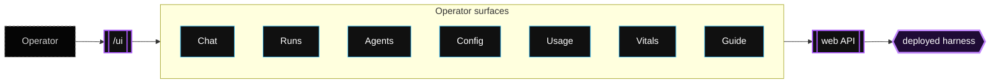

The operator UI is an optional React SPA mounted by the web service at `/ui`. It is for operating a deployed harness, not for creating a new project.



Enable it with:

```yaml
shared:
  ui: true
```

The web service dynamically loads `@render-harness/ui` when `serveWeb({ ui: true })` is used.

You can also enable it directly in code:

```ts
import { serveWeb } from "@render-harness/web";
import { agent } from "./agent.js";

await serveWeb({
  agent,
  ui: true,
});
```

Passing `ui: true` mounts the UI at `/ui`. To customize it, pass an object:

```ts
await serveWeb({
  agent,
  ui: {
    path: "/admin",
    cookieName: "harness_admin",
    cookieMaxAge: 60 * 60,
  },
});
```

The UI package is loaded dynamically, so services that do not enable the UI do not need to serve the SPA.

## Tabs

| Tab | Purpose |
| --- | --- |
| Chat | Start or resume conversations with deployed agents. |
| Runs | Inspect runs, messages, tool calls, tool results, and statuses. |
| Agents | View loaded agent definitions, tools, MCP servers, capability packs, mounted connectors, budgets, and skipped built-ins. |
| Config | Edit supported deployed config such as model settings, environment variables, and feature toggles. |
| Usage | View token, cost, and run usage rollups. |
| Vitals | View Render service instances, metrics, and logs when enabled. |
| Guide | Read deployment-specific guide content inside the running app. |

## Chat tab

The Chat tab uses the conversation API rather than raw one-off runs. Each user turn creates or resumes a conversation and streams updates through SSE.

Use it to:

- Talk to chat-shaped agents.
- Switch agents in multi-agent deployments.
- Keep conversation URLs stable.
- Resume a previous thread.

## Runs tab

The Runs tab is the main debugging surface. It shows the history behind a run, including tool calls and results.

Use it when:

- A run failed.
- A tool returned unexpected data.
- A run paused for input.
- You need to see which agent/version handled work.

## Agents tab

The Agents tab explains what the running service loaded at boot.

It surfaces:

- Agent names and descriptions.
- Models, budgets, and permissions.
- Local tools and MCP servers.
- Skipped built-ins and why they were skipped.

This helps distinguish “the manifest declares it” from “the running service actually loaded it.”

## Config tab

The Config tab is for supported deployed configuration edits. It relies on deployment metadata and wizard integration for write paths.

Use the Config tab for runtime-visible edits such as model changes, environment variable updates, and operator UI feature toggles. Structural changes, new runtimes, and Cron schedule changes still belong in source control and redeploys.

## Vitals tab

The Vitals tab is an opt-in Render observability surface. It shows Render service instances, CPU, memory, HTTP p95 latency, and recent logs for the current web service.

Enable it from the Config tab, or set this environment variable on the web service:

```sh
RENDER_HARNESS_VITALS_ENABLED=1
```

Vitals uses these environment variables:

| Variable | Purpose |
| --- | --- |
| `RENDER_HARNESS_VITALS_ENABLED` | Shows the Vitals tab when set to `1`, `true`, `yes`, or `on`. |
| `RENDER_SERVICE_ID` | Identifies the current Render service. Render injects this automatically on deployed services. |
| `RENDER_API_KEY` | Authenticates the web service to the Render API for metrics, instances, and logs. |
| `RENDER_OWNER_ID` | Identifies the workspace for log queries. Required by `GET /v1/logs`. |

The browser never receives `RENDER_API_KEY`. The operator UI calls `@render-harness/web`, and the web service proxies Render API responses into normalized `/vitals` JSON.

When Vitals is disabled, the tab is hidden from the sidebar and the `/vitals` endpoints return `vitals_disabled`. Enabling or disabling the feature through Config writes `RENDER_HARNESS_VITALS_ENABLED` via the Render API, so the service restarts before the new sidebar state appears.

## Guide tab

The Guide tab renders in-product documentation for the current deployment. It uses the deployment metadata endpoint to tailor text to the running bundle.

## Auth

The UI uses a signed cookie session. The web package wraps the normal API auth resolver so requests can authenticate with either the API key or UI session cookie.

Required environment variables commonly include:

- `WEB_API_KEY`
- `UI_COOKIE_SECRET`

`WEB_API_KEY` is the bearer key used by the JSON API and the UI login form. `UI_COOKIE_SECRET` signs the browser session cookie. Blueprints should generate `UI_COOKIE_SECRET` and prompt users to provide `WEB_API_KEY`.

## Local UI development

Use the operator demo to run the mounted UI locally:

```sh
pnpm db:up
pnpm dev:operator-web
pnpm dev:operator-worker
```

For hot module replacement while editing the SPA:

```sh
pnpm --filter @render-harness/ui dev:web
```

Log in once through the mounted service to seed the cookie, then use the Vite dev server for SPA edits.

## Important files

| File | Why it matters |
| --- | --- |
| `packages/ui/src/index.ts` | Server-side UI mount exports. |
| `packages/ui/src/server.ts` | UI server/session helper. |
| `packages/ui/web/src/App.tsx` | SPA root and tab routing. |
| `packages/ui/web/src/tabs/ChatTab.tsx` | Chat UI. |
| `packages/ui/web/src/tabs/RunsTab.tsx` | Run list and detail navigation. |
| `packages/ui/web/src/tabs/AgentsTab.tsx` | Agent metadata UI. |
| `packages/ui/web/src/tabs/ConfigTab.tsx` | Deployed config UI. |
| `packages/ui/web/src/tabs/UsageTab.tsx` | Usage UI. |
| `packages/ui/web/src/tabs/GuideTab.tsx` | In-product guide UI. |
