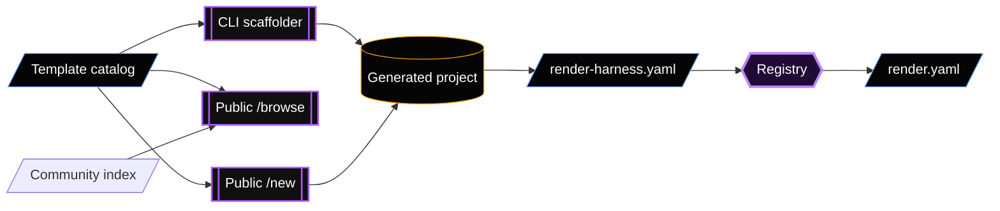

The registry and scaffolding packages turn source templates into runnable loops and Render infrastructure.



## Registry responsibilities

`@render-harness/registry` has two main surfaces:

- Runtime library: load `render-harness.yaml`, resolve capability packs, and return runnable agent definitions.
- Build tooling: emit Render infrastructure from the same manifest.

The registry owns:

- `render-harness.yaml` schemas.
- Template catalog loading.
- Capability pack contracts.
- Capability pack loading.
- Model presets.
- Deployment metadata enrichment.
- Blueprint emission.
- Deploy planning for resources that are not fully represented in Blueprints.

## Config loading

Runtime entrypoints call `defineFromConfig()`:

```ts
import { defineFromConfig } from "@render-harness/registry";

const { agentsById, config } = await defineFromConfig({
  configPath: "./render-harness.yaml",
});
```

Single-agent and multi-agent bundles both produce an `agentsById` map.

## Blueprint emission

The registry emits Render services from runtime declarations:

- `web` agents coalesce into one web service.
- `worker` agents coalesce into one worker service.
- `cron` runtimes emit one Cron service per schedule.
- Workflow-task agents produce Workflow service setup steps.
- Postgres is included for durable state.
- Key Value is included when needed by workers or capability packs.

For the publishing flow, see [Registry publishing](/registry-publishing/).

## CLI scaffolder

`create-render-agent` creates local projects. It can start from a blank agent or from a template catalog entry.

The CLI:

1. Loads the template catalog.
2. Prompts for template, name, model, runtimes, UI, and capabilities.
3. Builds a file map.
4. Writes `render-harness.yaml`, source entrypoints, package files, Docker Compose, and env files.
5. Optionally initializes Git and installs dependencies.

Local framework development commonly uses `--harness-root` so generated projects link to the local workspace packages.

## Public browse and new routes

The public wizard site uses the same gallery data but splits discovery from creation.

The `/browse` route:

- Serves `GET /api/browse`.
- Shows official template catalog entries.
- Shows community registry submissions from `registry-index/index.json`.
- Supports search and filters across source, runtime, category, capability, and kind.

The `/new` route:

- Serves `GET /api/gallery`.
- Starts a manual scaffolding flow.
- Accepts template-prefill links from `/browse`.
- Creates managed GitHub repos when configured.
- Produces deploy links.
- Supports model edit proxy flows for deployed loops.

Use `/new` for guided onboarding. Use the CLI for local-first scaffolding.

## Sealed bundles

A sealed bundle ships its manifest and source files as a unit. The scaffolder materializes the bundle files instead of asking the user to generate one agent from prompts.

The Chief of Staff template is a sealed bundle.

Sealed bundles are useful when a starter needs:

- Multiple agents.
- Multiple runtime entrypoints.
- Shared capabilities.
- Hand-authored TypeScript source files.

For the authoring flow, see [Authoring bundle templates](/authoring-bundle-templates/).

## Important files

| File | Why it matters |
| --- | --- |
| `packages/registry/src/schema.ts` | Manifest schema and runtime definitions. |
| `packages/registry/src/load-config.ts` | Manifest-to-agent loader. |
| `packages/registry/src/emitter.ts` | Blueprint emitter. |
| `packages/registry/src/gallery.ts` | Template catalog loader and serializer. |
| `packages/registry/src/capability.ts` | Capability pack contract. |
| `packages/create-render-agent/src/bin.ts` | CLI entrypoint. |
| `packages/create-render-agent/src/generate.ts` | File generation. |
| `packages/create-render-agent/src/templates/bundle.ts` | Sealed bundle runtime templates. |
| `apps/wizard/src/main.ts` | Browser wizard server. |
| `apps/wizard/src/routes/browse.ts` | Public browse API. |
| `apps/wizard/web/src/BrowsePage.tsx` | Public browse UI. |
| `apps/wizard/web/src/steps/Template.tsx` | Template picker UI. |
| `registry-index/index.json` | Community registry submissions. |
