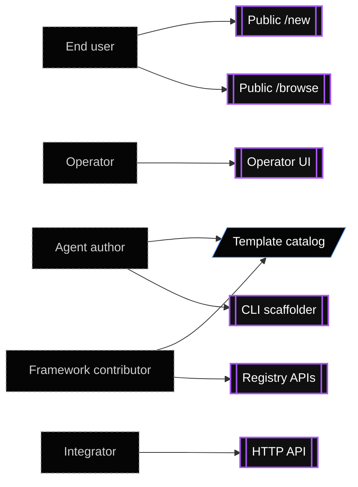
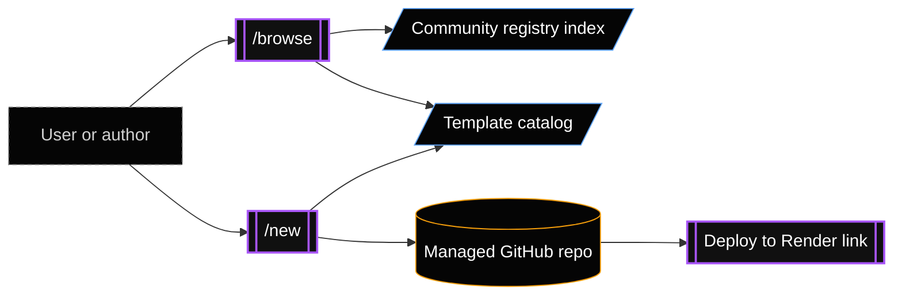
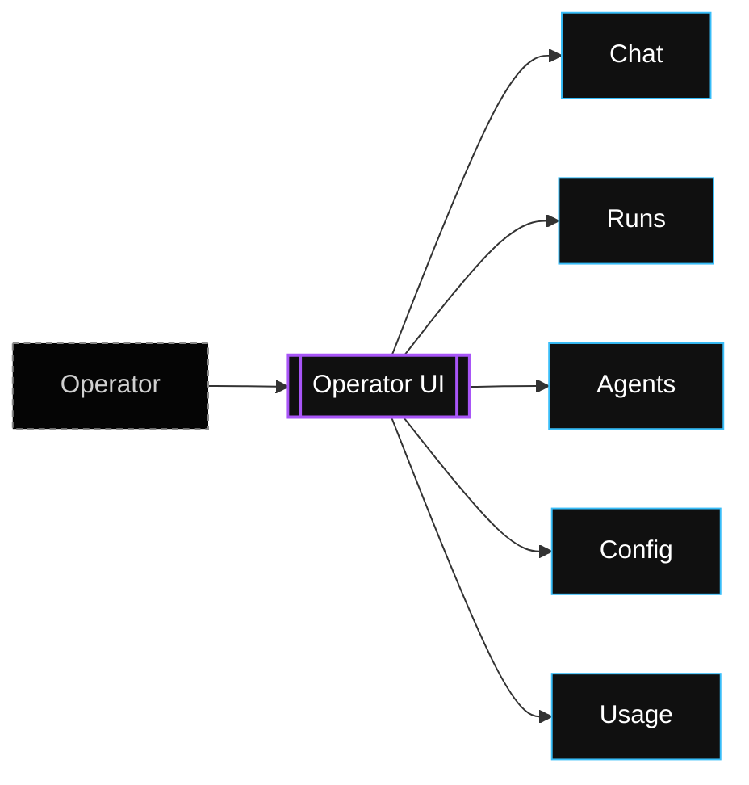
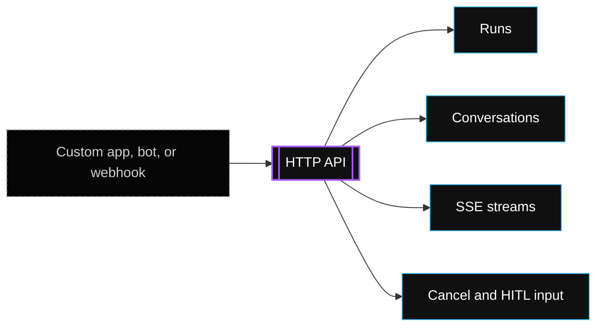
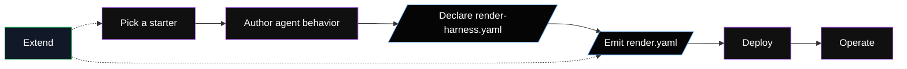

Render Loops has several user surfaces. They serve different stages of the agent lifecycle: creating a loop, deploying it, operating it, and extending the framework.



## Choose a surface

| Surface | Use it to | Where it lives |
| --- | --- | --- |
| CLI scaffolder | Create a new local project from a blank prompt or starter template. | `packages/create-render-agent` |
| Public `/browse` | Browse official templates and community loop submissions. | `apps/wizard` |
| Public `/new` | Create a manual managed GitHub repo and deployment flow from a web UI. | `apps/wizard` |
| Operator UI | Chat with deployed agents, inspect runs, view agents, edit config, and read in-product guides. | `packages/ui` mounted by `packages/web` |
| HTTP API | Create runs, stream results, send conversation turns, cancel work, and inspect usage. | `packages/web` |
| Template catalog | Store starter agents and bundles consumed by the CLI and wizard. | `gallery/` |
| Registry APIs | Load manifests, resolve capabilities, and emit Render infrastructure. | `packages/registry` |

## CLI scaffolder

Use the CLI when you want a project on your machine.

```sh
pnpm dlx create-render-agent my-agent
```

In this repo, local development commonly uses `--harness-root` so the scaffolded loop links to the local workspace packages:

```sh
pnpm --filter create-render-agent dev
create-render-agent my-agent --harness-root /path/to/render-harness
```

The CLI loads the template catalog, asks which starter to use, writes the project files, and prints local next steps.

Use the CLI when:

- You want to inspect and edit generated files immediately.
- You want to test framework changes against a newly scaffolded loop.
- You want a local loop before creating a GitHub repo.

## Public browse and new routes

Use the public wizard site when you want to discover loops or create a managed repo and deploy path.

The `/browse` route shows official templates from the template catalog alongside community registry submissions. The `/new` route starts a manual scaffolding flow. Starting from an official browse entry opens `/new` with that template prefilled.

The public site is the right surface when:

- You want a no-code or low-code onboarding flow.
- You want a managed GitHub repo created for the user.
- You want a deploy link instead of a local-only project.
- You want to compare official templates with community loops before starting.

The public site is implemented as a Hono server plus React SPA in `apps/wizard`.



## Template catalog

The template catalog is currently named `gallery/`. It is source data consumed by the CLI, `/new`, and the official entries shown on `/browse`.

The catalog includes:

- `gallery/index.yaml`: The list of available starters.
- `gallery/agents/*/render-harness.yaml`: The starter manifests.
- Optional `README.md` files for template previews.
- Optional `src/*` files for sealed bundles.

The current starters are:

- `chat`
- `support-bot`
- `research-cron`
- `chief-of-staff`

The Chief of Staff template is a sealed multi-agent bundle. It ships multiple agents and source files together instead of generating a single prompt-based agent.

## Deployed operator UI

The operator UI belongs to a specific deployed loop. Scaffolded projects mount it at the service root when UI is enabled. Library users can mount it elsewhere, including `/ui`, by passing a custom `ui.path`.

Use it after deployment to:

- Chat with an agent.
- Resume conversations.
- Inspect runs, messages, tool calls, and tool results.
- View loaded agents and skipped built-ins.
- View usage rollups.
- Edit supported model/config values through the Config tab.
- Read the in-product Guide.

The UI is not the public wizard site. It operates one loop that is already deployed.



## HTTP API

The web package exposes the production HTTP surface. Use it when you want to integrate an external app, custom frontend, Slack bot, webhook, or internal tool.

Common API actions include:

- Create a run.
- Stream a run.
- Create a conversation.
- Append a conversation message.
- Cancel a run.
- Send input to a paused run.
- List agents and usage.

The web service usually fronts a worker so requests return quickly while jobs continue in the background.



## Registry and framework APIs

Use source-level APIs when you are extending the framework itself.

Important registry responsibilities include:

- Parse and validate `render-harness.yaml`.
- Load starter templates from source or bundled snapshots.
- Resolve capability packs.
- Build `AgentDefinition` objects.
- Emit `render.yaml` Blueprints.
- Plan non-Blueprint resources such as Workflow services.

Most application authors should start with the CLI or wizard. Framework contributors usually work directly with the registry, runtimes, and core packages.

## Lifecycle map



| Stage | Primary surface |
| --- | --- |
| Pick a starting point | CLI scaffolder or public `/browse` |
| Author agent behavior | Generated TypeScript files |
| Declare deployment shape | `render-harness.yaml` |
| Build Render infrastructure | Registry and Blueprint emitter |
| Start runs | Web API, Cron, Worker, or Workflows |
| Operate deployed agents | The deployed loop's operator UI |
| Extend the framework | Core, registry, runtime, and capability packages |
