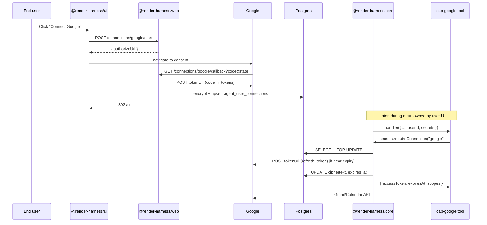

# Per-end-user OAuth connections (the connection API)

Internal design notes for the platform primitive that powers `cap-google`, future `cap-microsoft`, `cap-notion`, etc.

## Motivation

Capability packs like `cap-slack` / `cap-github` model the third-party API as a single deployment-wide token stored in `process.env`. That works when the agent's only job is to read one team's Slack or push to one org's GitHub.

For "personal assistant" packs (Gmail, Calendar, Drive, Notion, Linear-personal) the integration needs to be **per end user**: each chat user clicks "Connect Google" and the agent runs against *their* mailbox, not a single shared service account. Service-account / domain-wide delegation isn't a fit either — it's Workspace-only and requires admin involvement per tenant.

This is a net-new platform surface because nothing in the harness today stores per-user secrets:

- `agent_runs.user_id` is a tenancy label, not a credential vault.
- `LocalToolHandler.handler` received no user identity at all before this work — only builtins did, via `BuiltinContext`.
- The wizard has GitHub OAuth, but only for the wizard's own login session; the user access token gets discarded after the userinfo fetch.

## Decisions

1. **Generic across OAuth 2.0 providers** — Google, Microsoft, Notion, Linear, Atlassian, Dropbox, Stripe Connect, Slack-user-OAuth, etc. The pack contract is a flat `OAuthProviderConfig` (URLs, scopes, env names, two optional hooks for non-standard wire formats). See [Provider compatibility](#provider-compatibility) below.

2. **Per-user, scoped at tool-call time.** `runAgent` builds a `SecretsContext` once per run, closed over `run.user_id`. Tools call `secrets.requireConnection("google")` and the platform returns a guaranteed-fresh access token. There is no path for a tool to construct a SecretsContext for a different user.

3. **Encryption-at-rest with AES-256-GCM**, key from `CONNECTIONS_ENCRYPTION_KEY` (32 bytes base64). Refresh tokens and access tokens are encrypted together as one JSON blob; the row carries per-record IV + auth tag and a `key_version` column for future rotation. Plaintext refresh tokens never leave the database write path.

4. **Refresh-on-use, atomic.** The `SecretsContext.getConnection` path runs `BEGIN; SELECT ... FOR UPDATE; (maybe-refresh); UPDATE; COMMIT` so two concurrent tools on the same `(user, provider)` row don't race-clobber each other when a rotating provider (Microsoft, Slack-with-rotation) issues a new refresh token. Provider rotation is detected by `parsed.refreshToken !== undefined` and persisted in the same UPDATE.

5. **No run pause.** When a user hasn't connected yet, the tool throws `NeedsConnectionError` which `executeToolCall` turns into a normal `is_error: true` tool result. The model sees the error and can ask the user to visit `/ui/connections` — no special pause shape, no `paused` status. Next turn after the user connects, the same tool call succeeds.

6. **One OAuth client per provider per deployment.** v1 assumes the operator registers one OAuth app per provider in Google Cloud Console / Microsoft Entra / etc. Per-tenant OAuth clients ("each customer brings their own client_id") would need a separate `oauth_clients` table; deferred.

## Architecture

## Files

| Layer | File | Role |
|---|---|---|
| Schema | `packages/core/sql/0004_connections.sql` | `agent_user_connections` table. |
| Core | `packages/core/src/connections.ts` | `OAuthProviderConfig`, encrypt/decrypt, registry, CRUD, refresh-on-use, `SecretsContext` builder. |
| Core | `packages/core/src/loop-steps.ts` | Plumbs `userId` + `secrets` into `LocalToolHandler.handler`. |
| Core | `packages/core/src/loop.ts` | Builds `SecretsContext` once per `runAgent`. |
| Registry | `packages/registry/src/capability.ts` | `CapabilityPack.oauthProviders` + `connectionsRequired`. |
| Registry | `packages/registry/src/load-config.ts` | Auto-registers providers in core's registry from loaded packs. |
| Web | `packages/web/src/routes/connections.ts` | `/connections/:provider/start|callback`, `GET /connections`, `DELETE`. |
| Web | `packages/web/src/index.ts` | Mounts `/connections` routes when ≥1 provider is registered. |
| Web | `packages/web/src/routes/diagnostics.ts` | Validates `CONNECTIONS_ENCRYPTION_KEY` and per-provider client id/secret. |
| Contracts | `packages/contracts/src/index.ts` | `UserConnectionSummary`, `ConnectionsResp`, `StartConnectionResp`. |
| UI | `packages/ui/web/src/tabs/ConnectionsTab.tsx` | "Connect / Disconnect" buttons per provider. |
| First pack | `packages/capabilities/cap-google/` | Gmail + Calendar tools using the API. |

## Provider compatibility

The design is generic for any provider that implements **OAuth 2.0 Authorization Code grant with refresh tokens** (RFC 6749). That covers most modern SaaS.

| Provider | Fit | Notes |
|---|---|---|
| Google Workspace | ✅ | Needs `access_type=offline + prompt=consent` for refresh tokens. |
| Microsoft / Entra ID | ✅ | `offline_access` scope; rotates refresh tokens on every refresh (handled). |
| Notion / Linear / Atlassian / Zoom / HubSpot / Salesforce | ✅ | Drop in URLs + scopes. |
| Dropbox / Box / Discord / Stripe Connect | ✅ | Standard. |
| X / Twitter v2 | ✅ | OAuth 2.0 with PKCE. |
| Slack user-OAuth (`oauth.v2.access`) | ✅ | Needs `parseTokenResponse` hook — token under `authed_user.access_token`. |
| GitHub OAuth Apps | ✅ | Standard. |
| OAuth 1.0a (Twitter v1.1) | ❌ | Request signing per call. |
| JWT bearer / service accounts (GCP SA, GitHub Apps, AWS STS) | ❌ | Different primitive; deferred. |
| Per-tenant client credentials (customer-supplied client_id) | ❌ | Deferred — needs an `oauth_clients` table. |

Two optional hooks on `OAuthProviderConfig` cover the small number of providers that don't return tokens in the RFC 6749 shape:

- `parseTokenResponse(raw)` — for Slack's `authed_user` wrapper.
- `revoke({ accessToken, refreshToken, clientId, clientSecret })` — for providers whose revocation endpoint doesn't match `POST revokeUrl?token=...`.

## Threat model

- **Encryption key compromise** — an attacker with `CONNECTIONS_ENCRYPTION_KEY` and a DB dump can decrypt refresh tokens. Keep the key in a Render env group, not in source.
- **Cross-tenant access** — `SecretsContext` is constructed per tool invocation closed over `run.user_id`. No code path lets a tool query another `user_id`. Audit any future code that lifts this constraint.
- **Open redirect** — the callback route only redirects to a literal `/ui#/connections?connected=<provider>` string; no caller-controlled `next` param.
- **CSRF on callback** — Google's redirect carries no auth header; we recover `userId` from an HMAC-signed `state` token with a 10-minute TTL. The signing secret is `UI_COOKIE_SECRET`.
- **Provider denial** — when the user clicks "Cancel" on consent, the provider redirects with `?error=access_denied`; the callback route surfaces this as `/ui#/connections?error=access_denied&provider=google` and the UI shows an error toast.

## Future work

- **Key rotation.** `key_version` column is laid; the rotate script (decrypt-with-old + encrypt-with-new in batches) is a follow-up.
- **Drive / Docs / Sheets** in `cap-google`. Adding more tools doesn't change the connection API — just adds new tool definitions on top of the same `google` provider. Scope expansion prompts a re-consent (the UI surfaces a "Reconnect" affordance).
- **Service-account flows.** `serviceAccountProviders?` on the pack contract, JWT-bearer exchange in core.
- **Per-tenant OAuth clients** (multi-app support).
- **Token usage observability.** Emit `agent_user_connections.last_used_at` so the UI can show stale connections.
